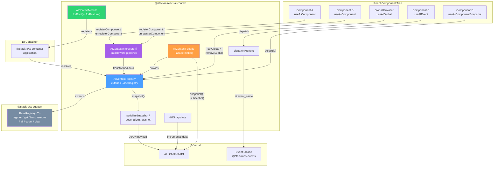
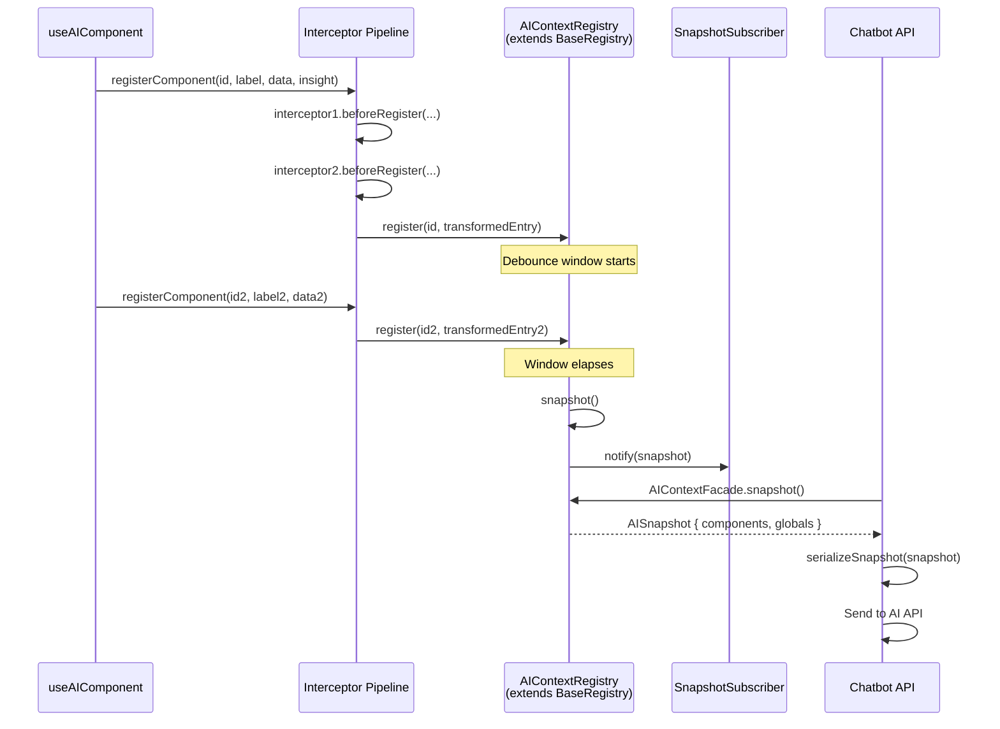
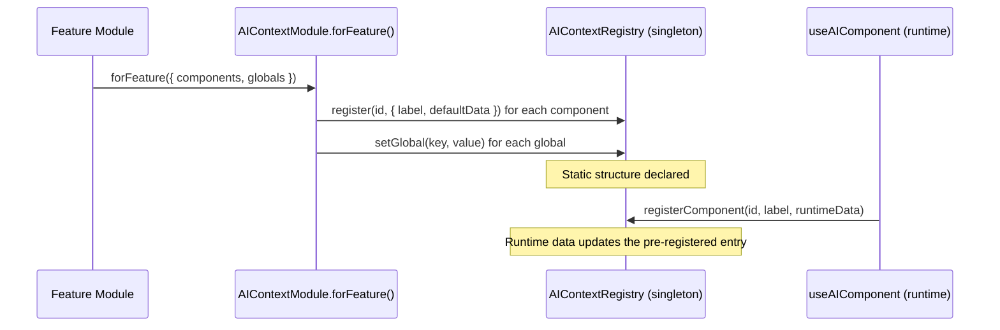

# Design Document — AI Context Engine

## Overview

The `@stackra/react-ai-context` package provides a DI-native registry that
collects semantic context from React components and global providers, then
exposes it as a normalized JSON snapshot for AI chatbot consumption. It follows
the same architectural patterns as `@stackra/ts-cache`, `@stackra/ts-events`,
and `@stackra/kbd`: a singleton service registered via a `forRoot()` module
(with `forFeature()` for feature-scoped pre-registration), a typed facade for
static access, and React hooks for lifecycle-aware registration.

The core service — `AIContextRegistry` — extends
`BaseRegistry<ComponentContextEntry>` from `@stackra/ts-support`, consistent
with `ShortcutRegistry`, `ThemeRegistry`, `RouteRegistry`, and other registries
in the monorepo. The inherited BaseRegistry provides standard Map-based
component storage (`register`, `get`, `has`, `remove`, `all`, `count`, `clear`).
On top of this, AIContextRegistry adds:

- A separate global context map (not stored in BaseRegistry)
- A debounced subscription system for snapshot change notifications
- A snapshot builder with optional payload-size truncation (LRU)
- An interceptor pipeline for transforming context before storage
- Context selectors for cross-component reads

React hooks (`useAIComponent`, `useAIGlobal`, `useAIEvent`,
`useAIComponentSnapshot`) handle mount/update/unmount lifecycle and
cross-component reads. The `AIContextFacade` gives the chatbot API layer
static-style access without React hooks. A `diffSnapshots` utility enables
incremental snapshot updates to reduce AI API token usage.

All implementation MUST follow the `docblocks-and-comments.md` standard:
file-level `@module` docblocks on every file, full multi-line JSDoc on every
exported symbol, `@param`/`@returns`/`@throws`/`@example` tags on all public
methods, section separators for grouping related methods, inline comments for
non-obvious logic, and interface properties documented individually with
`@default` and `@example`.

### Key Design Decisions

1. **Extends BaseRegistry, not a standalone Map.** AIContextRegistry extends
   `BaseRegistry<ComponentContextEntry>` from `@stackra/ts-support`, inheriting
   the standard registry API (`register`, `get`, `has`, `remove`, `all`,
   `count`, `clear`). This keeps the pattern consistent with ShortcutRegistry,
   ThemeRegistry, RouteRegistry, and all other registries in the monorepo.
   Component contexts are stored in the inherited BaseRegistry storage; global
   contexts use a separate Map.

2. **Single registry, not a manager pattern.** Unlike `CacheManager` (which
   manages multiple named stores), `AIContextRegistry` is a single singleton.
   There is no need for multiple named instances — one registry per application
   is the correct model.

3. **forFeature() for declarative pre-registration.** Feature modules can
   declare their component contexts and default globals upfront via
   `AIContextModule.forFeature()`, following the same pattern as
   `ThemeModule.forFeature()`, `KbdModule.forFeature()`, and
   `DesktopModule.forFeature()`. Hooks then update the data at runtime.

4. **Interceptor pipeline before storage.** Registered `AIContextInterceptor`
   instances transform or enrich context data before it enters the registry.
   This enables cross-cutting concerns (timestamps, route info, user IDs)
   without modifying individual hooks.

5. **Debounce at the registry level.** Subscriber notifications are debounced
   inside the registry using a configurable window. This keeps the hooks simple
   (they just call register/unregister) and centralizes the batching logic.

6. **LRU truncation for payload safety.** When `maxPayloadSize` is configured,
   the snapshot builder tracks last-updated timestamps on component entries and
   removes the oldest entries first to fit within the byte limit.

7. **Serialization filtering in hooks.** The `useAIComponent` hook strips
   non-serializable values (functions, symbols, undefined) before registering,
   so the registry itself never stores non-serializable data.

8. **Event integration via existing EventFacade.** Semantic AI events are
   dispatched through the existing `@stackra/ts-events` infrastructure with an
   `ai:` prefix — no new event system is introduced.

9. **Snapshot diffing for incremental updates.** The `diffSnapshots` utility
   computes a delta between two snapshots, enabling the chatbot API to send only
   what changed — reducing token usage and API costs.

10. **Full docblocks per standard.** All files, classes, interfaces, methods,
    hooks, constants, and types follow the `docblocks-and-comments.md` standard
    with no exceptions.

## Architecture



### Data Flow



### forFeature Data Flow



## Components and Interfaces

### AIContextRegistry Service

The central singleton service. Extends `BaseRegistry<ComponentContextEntry>`
from `@stackra/ts-support`. Decorated with `@Injectable()` and registered via
`AIContextModule.forRoot()`.

```typescript
@Injectable()
class AIContextRegistry extends BaseRegistry<ComponentContextEntry> {
  // ── Internal State ────────────────────────────────────────────────────
  private readonly _globals: Map<string, unknown>;
  private readonly _subscribers: Set<SnapshotSubscriber>;
  private readonly _interceptors: AIContextInterceptor[];
  private _debounceTimer: ReturnType<typeof setTimeout> | null;
  private readonly _debounceMs: number;
  private readonly _maxPayloadSize: number | undefined;

  constructor(@Inject(AI_CONTEXT_CONFIG) config: AIContextConfig);

  // ── Component Registration ────────────────────────────────────────────
  public registerComponent(id: string, label: string, data: Record<string, unknown>, insight?: string): void;
  public unregisterComponent(id: string): void;

  // ── Global Context ────────────────────────────────────────────────────
  public setGlobal(key: string, value: unknown): void;
  public removeGlobal(key: string): void;

  // ── Selectors ─────────────────────────────────────────────────────────
  public select(componentId: string): ComponentContextEntry | undefined;

  // ── Snapshot ──────────────────────────────────────────────────────────
  public snapshot(): AISnapshot;

  // ── Subscriptions ─────────────────────────────────────────────────────
  public subscribe(callback: SnapshotSubscriber): () => void;

  // ── Accessors ─────────────────────────────────────────────────────────
  public get componentCount(): number;
  public get globalKeys(): string[];

  // ── Reset (overrides BaseRegistry.clear) ──────────────────────────────
  public override clear(): void;

  // ── Private ───────────────────────────────────────────────────────────
  private _runInterceptors(id: string, label: string, data: Record<string, unknown>, insight?: string): { id: string; label: string; data: Record<string, unknown>; insight?: string };
  private _notifySubscribers(): void;
  private _scheduleNotification(): void;
  private _buildTruncatedSnapshot(full: AISnapshot): AISnapshot;
}
```

**Inherited from BaseRegistry<ComponentContextEntry>:**

- `register(key: string, entry: ComponentContextEntry): void` — add/update entry
- `get(key: string): ComponentContextEntry | undefined` — retrieve entry
- `has(key: string): boolean` — check existence
- `remove(key: string): void` — remove entry
- `all(): ComponentContextEntry[]` — get all entries
- `count(): number` — get entry count
- `clear(): void` — remove all entries (overridden)

The `registerComponent` method builds a `ComponentContextEntry`, runs the
interceptor pipeline, then calls the inherited `register(id, entry)`. The
`unregisterComponent` method calls the inherited `remove(id)`. The `select`
method calls the inherited `get(id)`. The `componentCount` accessor returns
`this.count()`. The `clear()` override calls `super.clear()` for component
entries, then clears globals and subscribers.

### AIContextInterceptor Interface

```typescript
interface AIContextInterceptor {
  /**
   * Transform or enrich context data before it enters the registry.
   *
   * @param id - Component ID
   * @param label - Semantic label
   * @param data - Data payload
   * @param insight - Optional insight classifier
   * @returns Transformed context data
   */
  beforeRegister(
    id: string,
    label: string,
    data: Record<string, unknown>,
    insight?: string
  ): {
    id: string;
    label: string;
    data: Record<string, unknown>;
    insight?: string;
  };
}
```

### React Hooks

**useAIComponent** — registers component context on mount, updates on change,
unregisters on unmount.

```typescript
function useAIComponent(
  id: string,
  label: string,
  data: Record<string, unknown>,
  options?: { insight?: string; disabled?: boolean }
): void;
```

**useAIGlobal** — pushes a global context entry on mount, updates on change,
removes on unmount.

```typescript
function useAIGlobal(key: string, value: unknown): void;
```

**useAIEvent** — returns a dispatch function for emitting semantic AI events.

```typescript
function useAIEvent(): {
  dispatch: (name: string, payload?: Record<string, unknown>) => void;
};
```

**useAIComponentSnapshot** — reads a specific component's context from the
registry, re-renders on change. Enables cross-component AI features.

```typescript
function useAIComponentSnapshot(id: string): ComponentContextEntry | undefined;
```

### AIContextModule

```typescript
@Module({})
class AIContextModule {
  static forRoot(config?: Partial<AIContextConfig>): DynamicModule;
  static forFeature(featureConfig: AIContextFeatureConfig): DynamicModule;
}
```

**forRoot()** — registers the AIContextRegistry as a global DI singleton,
applies configuration (debounce, maxPayloadSize, interceptors). Returns
`{ global: true }`.

**forFeature()** — pre-registers component contexts and default globals in the
global AIContextRegistry singleton. Returns
`{ module, providers: [], exports: [] }`, consistent with
`ThemeModule.forFeature()`, `KbdModule.forFeature()`, etc.

Example usage:

```typescript
@Module({
  imports: [
    AIContextModule.forFeature({
      components: [
        { id: 'cart', label: 'CartSummary', defaultData: {} },
        { id: 'cart-items', label: 'CartItemList', defaultData: {} },
      ],
      globals: {
        'cart-feature-enabled': true,
      },
    }),
  ],
})
export class CartModule {}
```

### AIContextFacade

```typescript
const AIContextFacade: AIContextRegistry =
  Facade.make<AIContextRegistry>(AI_CONTEXT_REGISTRY);
```

### Utility Functions

```typescript
function dispatchAIEvent(name: string, payload?: Record<string, unknown>): void;
function serializeSnapshot(snapshot: AISnapshot): string;
function deserializeSnapshot(json: string): AISnapshot;
function diffSnapshots(previous: AISnapshot, current: AISnapshot): SnapshotDiff;
```

## Data Models

### AIContextConfig

Configuration object injected via `AI_CONTEXT_CONFIG` token.

````typescript
interface AIContextConfig {
  /**
   * Debounce window in milliseconds for subscriber notifications.
   * Set to 0 for synchronous notifications.
   * @default 150
   */
  debounce: number;

  /**
   * Maximum serialized payload size in bytes.
   * When set, snapshot() truncates least-recently-updated components to fit.
   * @default undefined (no limit)
   */
  maxPayloadSize?: number;

  /**
   * Interceptors to run before storing component context.
   * Executed in order; each receives the output of the previous.
   * @default [] (no interceptors)
   *
   * @example
   * ```typescript
   * AIContextModule.forRoot({
   *   interceptors: [new TimestampInterceptor(), new RouteInterceptor()],
   * })
   * ```
   */
  interceptors?: AIContextInterceptor[];
}
````

### AIContextFeatureConfig

Configuration object passed to `AIContextModule.forFeature()`.

````typescript
interface AIContextFeatureConfig {
  /**
   * Component contexts to pre-register in the global registry.
   * Hooks update the data at runtime; this declares the structure upfront.
   *
   * @default [] (no components)
   * @example
   * ```typescript
   * {
   *   components: [
   *     { id: 'cart', label: 'CartSummary', defaultData: {} },
   *     { id: 'cart-items', label: 'CartItemList', defaultData: { count: 0 } },
   *   ]
   * }
   * ```
   */
  components?: AIContextFeatureComponent[];

  /**
   * Default global context entries to register.
   * Keys are global context names, values are default values.
   *
   * @default {} (no globals)
   * @example
   * ```typescript
   * {
   *   globals: {
   *     'cart-feature-enabled': true,
   *     'cart-version': '2.0',
   *   }
   * }
   * ```
   */
  globals?: Record<string, unknown>;
}
````

### AIContextFeatureComponent

A single component declaration within `AIContextFeatureConfig.components`.

```typescript
interface AIContextFeatureComponent {
  /** Unique component identifier */
  id: string;

  /** Human-readable semantic label */
  label: string;

  /** Default data payload, used until the hook provides runtime data */
  defaultData: Record<string, unknown>;
}
```

### ComponentContext

Represents a single component's semantic data in the registry.

```typescript
interface ComponentContext {
  /** Unique component identifier */
  id: string;

  /** Human-readable semantic label (e.g., "ProductCard", "CartSummary") */
  label: string;

  /** Arbitrary JSON-serializable data payload */
  data: Record<string, unknown>;

  /** Optional insight classifier (e.g., "active_cart", "empty_state") */
  insight?: string;
}
```

### ComponentContextEntry (internal)

Internal entry stored in the BaseRegistry storage, extending `ComponentContext`
with a timestamp for LRU truncation. This is the type parameter for
`BaseRegistry<ComponentContextEntry>`.

```typescript
interface ComponentContextEntry extends ComponentContext {
  /** Timestamp of last registration or update (Date.now()) */
  updatedAt: number;
}
```

### GlobalContext

Global context entries are stored as `Map<string, unknown>` — the key is the
context name (e.g., `"user"`, `"theme"`, `"route"`) and the value is any
JSON-serializable data. No dedicated interface is needed beyond the map itself.

### AISnapshot

The normalized JSON payload returned by `snapshot()`.

```typescript
interface AISnapshot {
  /** All component contexts keyed by component ID */
  components: Record<string, AISnapshotComponent>;

  /**
   * Indicates the snapshot was truncated due to maxPayloadSize.
   * Only present when truncation occurred.
   */
  _truncated?: boolean;

  /**
   * Number of component contexts removed during truncation.
   * Only present when truncation occurred.
   */
  _truncatedCount?: number;

  /** Global context entries spread as top-level keys */
  [key: string]: unknown;
}
```

### AISnapshotComponent

A single component entry within the snapshot's `components` object.

```typescript
interface AISnapshotComponent {
  /** Human-readable semantic label */
  label: string;

  /** The component's data payload */
  data: Record<string, unknown>;

  /** Optional insight classifier */
  insight?: string;
}
```

### SnapshotDiff

The result of comparing two AISnapshot objects.

```typescript
interface SnapshotDiff {
  /** Components present in current but not in previous */
  added: {
    components: Record<string, AISnapshotComponent>;
    globals: Record<string, unknown>;
  };

  /** Components present in previous but not in current */
  removed: {
    components: string[];
    globals: string[];
  };

  /** Components present in both but with different values */
  modified: {
    components: Record<string, AISnapshotComponent>;
    globals: Record<string, unknown>;
  };
}
```

### SnapshotSubscriber

Callback type for snapshot change notifications.

```typescript
type SnapshotSubscriber = (snapshot: AISnapshot) => void;
```

### DI Tokens

```typescript
/** Injection token for AIContextRegistry */
const AI_CONTEXT_REGISTRY = Symbol.for('AI_CONTEXT_REGISTRY');

/** Injection token for AIContextConfig */
const AI_CONTEXT_CONFIG = Symbol.for('AI_CONTEXT_CONFIG');
```

### File / Folder Structure

```
packages/ai-context/
├── package.json
├── tsconfig.json
├── tsup.config.ts
├── vitest.config.ts
├── src/
│   ├── index.ts                                  # Public API barrel
│   ├── ai-context.module.ts                      # AIContextModule with forRoot() / forFeature()
│   ├── constants/
│   │   ├── index.ts
│   │   └── tokens.constant.ts                    # AI_CONTEXT_REGISTRY, AI_CONTEXT_CONFIG
│   ├── facades/
│   │   ├── index.ts
│   │   └── ai-context.facade.ts                  # AIContextFacade
│   ├── hooks/
│   │   ├── index.ts
│   │   ├── use-ai-component.hook.ts              # useAIComponent
│   │   ├── use-ai-component-snapshot.hook.ts     # useAIComponentSnapshot
│   │   ├── use-ai-global.hook.ts                 # useAIGlobal
│   │   └── use-ai-event.hook.ts                  # useAIEvent
│   ├── interfaces/
│   │   ├── index.ts
│   │   ├── ai-context-config.interface.ts        # AIContextConfig
│   │   ├── ai-context-feature-config.interface.ts # AIContextFeatureConfig, AIContextFeatureComponent
│   │   ├── ai-context-interceptor.interface.ts   # AIContextInterceptor
│   │   ├── ai-snapshot.interface.ts              # AISnapshot, AISnapshotComponent
│   │   ├── component-context.interface.ts        # ComponentContext, ComponentContextEntry
│   │   └── snapshot-diff.interface.ts            # SnapshotDiff
│   ├── services/
│   │   ├── index.ts
│   │   └── ai-context-registry.service.ts        # AIContextRegistry extends BaseRegistry
│   ├── types/
│   │   ├── index.ts
│   │   └── snapshot-subscriber.type.ts           # SnapshotSubscriber
│   └── utils/
│       ├── index.ts
│       ├── dispatch-ai-event.util.ts             # dispatchAIEvent
│       ├── serialize-snapshot.util.ts            # serializeSnapshot
│       ├── deserialize-snapshot.util.ts          # deserializeSnapshot
│       ├── diff-snapshots.util.ts               # diffSnapshots
│       └── strip-non-serializable.util.ts        # stripNonSerializable (internal)
```

## Correctness Properties

_A property is a characteristic or behavior that should hold true across all
valid executions of a system — essentially, a formal statement about what the
system should do. Properties serve as the bridge between human-readable
specifications and machine-verifiable correctness guarantees._

### Property 1: Component registration round-trip

_For any_ set of N components with distinct IDs, after registering all N
components via `registerComponent`, the inherited `count()` SHALL equal N,
`has(id)` SHALL return `true` for each ID, `get(id)` SHALL return the matching
ComponentContextEntry with correct label, data, and insight, and
`snapshot().components` SHALL contain exactly those N entries. After calling
`unregisterComponent` on one ID, `count()` SHALL equal N-1, `has(id)` SHALL
return `false` for the removed ID, and `snapshot().components` SHALL contain N-1
entries.

**Validates: Requirements 1.3, 1.5, 1.6, 1.7, 1.11, 2.1, 2.2**

### Property 2: Global context registration round-trip

_For any_ set of N global context entries with distinct keys, after calling
`setGlobal` for all N entries, `snapshot()` SHALL contain all N keys as
top-level properties with matching values, and `globalKeys` SHALL return exactly
those N keys. After calling `removeGlobal` on one key, `snapshot()` SHALL no
longer contain that key and `globalKeys` SHALL return N-1 keys. Global entries
SHALL NOT appear in the inherited BaseRegistry storage (`all()` SHALL not
contain them).

**Validates: Requirements 1.4, 1.9, 1.10, 1.12, 2.1**

### Property 3: Snapshot JSON round-trip serialization

_For any_ valid registry state (arbitrary combination of registered components
and global context entries), `JSON.parse(JSON.stringify(snapshot()))` SHALL
produce an object deeply equal to the original snapshot.

**Validates: Requirements 2.4, 2.6**

### Property 4: Snapshot immutability (new reference per call)

_For any_ registry state, two consecutive calls to `snapshot()` SHALL return
different object references that are deeply equal to each other.

**Validates: Requirements 2.5**

### Property 5: Subscriber notification on any change

_For any_ set of N registered subscribers and any single context mutation
(registerComponent, unregisterComponent, setGlobal, or removeGlobal), all N
subscribers SHALL be invoked with the latest snapshot after the debounce window
elapses.

**Validates: Requirements 3.2, 3.3**

### Property 6: Unsubscribe prevents future notifications

_For any_ subscriber that has been unsubscribed, subsequent context mutations
SHALL NOT invoke that subscriber's callback, while other active subscribers
SHALL still be notified.

**Validates: Requirements 3.4**

### Property 7: Debounce batches multiple changes into one notification

_For any_ N context mutations occurring within a single debounce window, each
subscriber SHALL be notified exactly once after the window elapses, and the
delivered snapshot SHALL reflect all N mutations (the latest state).

**Validates: Requirements 4.2, 4.3, 4.5**

### Property 8: Zero debounce means synchronous notification

_For any_ registry configured with `debounce: 0` and any sequence of N context
mutations, each subscriber SHALL be notified exactly N times — once per
mutation, synchronously.

**Validates: Requirements 4.4**

### Property 9: Non-serializable value stripping

_For any_ data object containing a mix of JSON-serializable values (strings,
numbers, booleans, arrays, plain objects, null) and non-serializable values
(functions, symbols, undefined), the `stripNonSerializable` utility SHALL return
an object containing only the serializable values, and the result SHALL be
JSON-serializable.

**Validates: Requirements 5.5**

### Property 10: AI event name prefixing

_For any_ event name string, `dispatchAIEvent(name, payload)` SHALL emit an
event whose name equals `"ai:" + name` through the EventFacade.

**Validates: Requirements 9.2**

### Property 11: Payload truncation by LRU order

_For any_ registry state where the serialized snapshot exceeds `maxPayloadSize`,
the returned snapshot SHALL have a serialized size ≤ `maxPayloadSize`, the
`_truncated` field SHALL be `true`, `_truncatedCount` SHALL equal the number of
removed component entries, and the removed entries SHALL be those with the
oldest `updatedAt` timestamps.

**Validates: Requirements 10.2, 10.3**

### Property 12: Serialize/deserialize snapshot round-trip

_For any_ valid AISnapshot object,
`deserializeSnapshot(serializeSnapshot(snapshot))` SHALL produce an AISnapshot
deeply equal to the original.

**Validates: Requirements 11.3**

### Property 13: Clear resets all registry state

_For any_ registry state with registered components, global entries, and
subscribers, after calling `clear()`, the inherited `count()` SHALL be 0,
`globalKeys` SHALL be an empty array, `snapshot().components` SHALL be an empty
object with no global keys, and the inherited `all()` SHALL return an empty
array.

**Validates: Requirements 12.1**

### Property 14: Interceptor pipeline transforms data in order

_For any_ sequence of N interceptors and any component registration, the
interceptors SHALL execute in registration order, each receiving the output of
the previous interceptor. The final stored ComponentContextEntry SHALL match the
output of the last interceptor. When no interceptors are registered, the stored
entry SHALL match the original input unchanged.

**Validates: Requirements 15.3, 15.4, 15.5**

### Property 15: forFeature pre-registers components and globals

_For any_ AIContextFeatureConfig with M component declarations and K global
entries, after calling `AIContextModule.forFeature(config)`, the global
AIContextRegistry SHALL contain all M components (accessible via `has(id)` and
`get(id)`) with matching labels and default data, and `snapshot()` SHALL contain
all K global entries as top-level keys with matching values.

**Validates: Requirements 8.7, 8.8**

### Property 16: Context selector returns correct entry

_For any_ set of registered components, `select(id)` SHALL return the matching
ComponentContextEntry for registered IDs and `undefined` for unregistered IDs.
The returned entry SHALL be identical to the result of the inherited `get(id)`.

**Validates: Requirements 16.1, 16.5**

### Property 17: Snapshot diff correctness

_For any_ two valid AISnapshot objects (previous and current),
`diffSnapshots(previous, current)` SHALL return a SnapshotDiff where: `added`
contains all components and globals present in current but not in previous,
`removed` contains all component IDs and global keys present in previous but not
in current, and `modified` contains all components and globals present in both
but with different values. Applying the diff to the previous snapshot SHALL
produce the current snapshot.

**Validates: Requirements 17.2, 17.3, 17.4, 17.5**

## Error Handling

### deserializeSnapshot Errors

| Condition                                 | Error Type                                                         | Message Pattern                                             |
| ----------------------------------------- | ------------------------------------------------------------------ | ----------------------------------------------------------- |
| Invalid JSON string                       | `SyntaxError` (from `JSON.parse`) wrapped in a descriptive `Error` | `"Failed to deserialize snapshot: invalid JSON"`            |
| Valid JSON, missing `components` key      | `Error`                                                            | `"Invalid AISnapshot: missing 'components' object"`         |
| Valid JSON, `components` is not an object | `Error`                                                            | `"Invalid AISnapshot: 'components' must be a plain object"` |

### Registry Edge Cases

| Condition                             | Behavior                                                               |
| ------------------------------------- | ---------------------------------------------------------------------- |
| `unregisterComponent` with unknown ID | No-op, no error (inherited `remove` on missing key)                    |
| `removeGlobal` with unknown key       | No-op, no error                                                        |
| Double unsubscribe                    | No-op, no error (Set.delete on missing element)                        |
| `snapshot()` on empty registry        | Returns `{ components: {} }`                                           |
| `clear()` on empty registry           | No-op, no error (calls `super.clear()` + clears globals + subscribers) |

### Hook Edge Cases

| Condition                                   | Behavior                                                                                                       |
| ------------------------------------------- | -------------------------------------------------------------------------------------------------------------- |
| `useAIComponent` with `disabled: true`      | Skips registration; if previously registered, calls `unregisterComponent`                                      |
| `useAIComponent` with non-serializable data | Strips non-serializable values before registering                                                              |
| `useAIGlobal` with `undefined` value        | Calls `setGlobal(key, undefined)` — the key exists but value is undefined; snapshot serialization will omit it |
| `useAIComponentSnapshot` with unknown ID    | Returns `undefined`; re-renders if the component is later registered                                           |

### Truncation Edge Cases

| Condition                                          | Behavior                                                                                        |
| -------------------------------------------------- | ----------------------------------------------------------------------------------------------- |
| `maxPayloadSize` smaller than global context alone | All components removed; snapshot contains only globals + `_truncated: true` + `_truncatedCount` |
| `maxPayloadSize` is 0                              | All components removed (edge case; not a practical configuration)                               |
| Single component exceeds limit                     | That component is removed; `_truncatedCount: 1`                                                 |

### Interceptor Edge Cases

| Condition                     | Behavior                                                                    |
| ----------------------------- | --------------------------------------------------------------------------- |
| Interceptor throws an error   | Skipped; warning logged; remaining interceptors continue with previous data |
| No interceptors registered    | Original values stored unchanged                                            |
| Interceptor returns same data | No-op transform; data stored as-is                                          |

### Diff Edge Cases

| Condition                                 | Behavior                                                                |
| ----------------------------------------- | ----------------------------------------------------------------------- |
| Both snapshots identical                  | Returns empty `added`, `removed`, `modified` sections                   |
| Previous snapshot empty, current has data | All entries in `added`; `removed` and `modified` empty                  |
| Current snapshot empty, previous has data | All entries in `removed`; `added` and `modified` empty                  |
| Only global context differs               | Component sections empty; globals reflected in appropriate diff section |

## Testing Strategy

### Testing Framework

- **Unit tests**: vitest (already standard in the monorepo)
- **Property-based tests**: `fast-check` with vitest — minimum 100 iterations
  per property
- **React hook tests**: `@testing-library/react` with vitest and jsdom
  environment

### Property-Based Testing Configuration

Each property test must:

- Run a minimum of 100 iterations
- Reference its design document property via a tag comment
- Tag format: `Feature: ai-context-engine, Property {N}: {title}`

Library: `fast-check` — the standard PBT library for TypeScript/JavaScript.

### Test Organization

```
packages/ai-context/
├── __tests__/
│   ├── ai-context-registry.test.ts           # Unit tests for registry (BaseRegistry integration)
│   ├── ai-context-registry.pbt.test.ts       # Property-based tests (Properties 1-8, 13, 16)
│   ├── snapshot-serialization.pbt.test.ts    # Property-based tests (Properties 3, 12)
│   ├── strip-non-serializable.pbt.test.ts    # Property-based test (Property 9)
│   ├── dispatch-ai-event.test.ts             # Unit + property test (Property 10)
│   ├── truncation.pbt.test.ts                # Property-based test (Property 11)
│   ├── interceptors.pbt.test.ts              # Property-based test (Property 14)
│   ├── for-feature.pbt.test.ts               # Property-based test (Property 15)
│   ├── context-selectors.pbt.test.ts         # Property-based test (Property 16)
│   ├── diff-snapshots.pbt.test.ts            # Property-based test (Property 17)
│   ├── use-ai-component.test.ts              # Hook unit tests (jsdom)
│   ├── use-ai-global.test.ts                 # Hook unit tests (jsdom)
│   ├── use-ai-event.test.ts                  # Hook unit tests (jsdom)
│   ├── use-ai-component-snapshot.test.ts     # Hook unit tests (jsdom)
│   ├── ai-context-module.test.ts             # Module wiring tests (forRoot + forFeature)
│   └── deserialize-snapshot.test.ts          # Error case unit tests
```

### Test Coverage by Type

**Property-based tests** (universal properties, 100+ iterations each):

- Properties 1–17 as defined in the Correctness Properties section
- Generators for: component IDs, labels, data payloads, insights, global keys,
  global values, AISnapshot objects, interceptor chains, feature configs,
  snapshot pairs

**Unit tests** (specific examples, edge cases):

- Empty registry snapshot
- Module `forRoot()` returns correct DynamicModule shape with `global: true`
- Module `forFeature()` returns correct DynamicModule shape with empty
  providers/exports
- Module default config (debounce: 150)
- Hook mount/update/unmount lifecycle (useAIComponent, useAIGlobal,
  useAIComponentSnapshot)
- Hook `disabled` option
- `useAIComponentSnapshot` returns `undefined` for unknown ID
- `useAIComponentSnapshot` re-renders on component change
- `deserializeSnapshot` with invalid JSON
- `deserializeSnapshot` with invalid structure
- Double unsubscribe no-op
- `unregisterComponent` with unknown ID no-op
- `clear()` notifies subscribers with empty snapshot before removing them
- `clear()` calls `super.clear()` for BaseRegistry cleanup
- Interceptor error handling (skip and continue)
- `diffSnapshots` with identical snapshots returns empty diff
- `diffSnapshots` with empty previous returns all as added
- BaseRegistry inheritance verification (`instanceof BaseRegistry`)

**Integration tests** (facade wiring):

- `AIContextFacade.snapshot()` matches registry `snapshot()`
- `Facade.swap()` replaces the registry instance
- `Facade.clearResolvedInstances()` resets facade

### Custom Generators (fast-check)

```typescript
// Component ID: non-empty alphanumeric + hyphens
const arbComponentId = fc
  .string({ minLength: 1, maxLength: 50 })
  .filter((s) => s.trim().length > 0);

// Label: non-empty string
const arbLabel = fc.string({ minLength: 1, maxLength: 100 });

// Serializable data payload: JSON-serializable record
const arbData = fc.dictionary(
  fc.string({ minLength: 1, maxLength: 20 }),
  fc.oneof(fc.string(), fc.integer(), fc.boolean(), fc.constant(null))
);

// Insight: optional short classifier string
const arbInsight = fc.option(fc.string({ minLength: 1, maxLength: 30 }));

// Global key: non-empty string, excluding reserved keys
const arbGlobalKey = fc
  .string({ minLength: 1, maxLength: 30 })
  .filter((k) => !['components', '_truncated', '_truncatedCount'].includes(k));

// Global value: any JSON-serializable value
const arbGlobalValue = fc.oneof(
  fc.string(),
  fc.integer(),
  fc.boolean(),
  fc.constant(null),
  fc.dictionary(fc.string(), fc.string())
);

// AISnapshot: valid snapshot object
const arbSnapshot = fc.record({
  components: fc.dictionary(
    arbComponentId,
    fc.record({
      label: arbLabel,
      data: arbData,
      insight: arbInsight,
    })
  ),
});

// Feature component declaration
const arbFeatureComponent = fc.record({
  id: arbComponentId,
  label: arbLabel,
  defaultData: arbData,
});

// Feature config
const arbFeatureConfig = fc.record({
  components: fc.option(
    fc.array(arbFeatureComponent, { minLength: 0, maxLength: 10 })
  ),
  globals: fc.option(fc.dictionary(arbGlobalKey, arbGlobalValue)),
});

// Interceptor: transforms data by adding a key
const arbInterceptor = fc
  .string({ minLength: 1, maxLength: 10 })
  .map((key) => ({
    beforeRegister: (
      id: string,
      label: string,
      data: Record<string, unknown>,
      insight?: string
    ) => ({
      id,
      label,
      data: { ...data, [`_intercepted_${key}`]: true },
      insight,
    }),
  }));

// Snapshot pair for diff testing
const arbSnapshotPair = fc.tuple(arbSnapshot, arbSnapshot);
```
