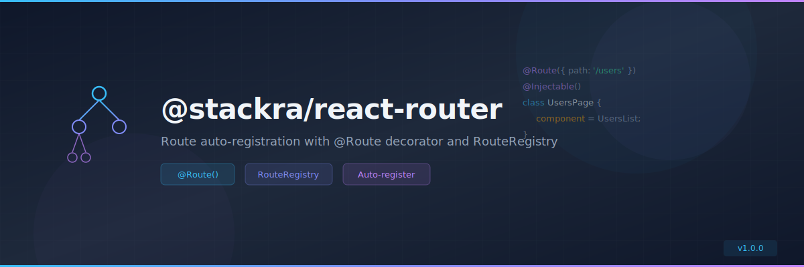

<p align="center">
  
</p>

<p align="center">
  <a href="https://www.npmjs.com/package/@stackra/react-router">
    
  </a>
  <a href="./LICENSE">
    
  </a>
  <a href="https://www.typescriptlang.org/">
    
  </a>
</p>

---

# @stackra/react-router

Route auto-registration package with `@Route` decorator and `RouteRegistry` for
`@stackra/react-refine`. Eliminates manual route configuration by discovering
routes at build time.

## Installation

```bash
pnpm add @stackra/react-router
```

## Features

- 🎭 `@Route()` decorator for declarative route definition
- 📋 `RouteRegistry` — injectable registry of all registered routes
- �� Auto-registration with `@stackra/react-refine`
- 💉 DI integration via `@stackra/ts-container`
- 🏗️ `RouterModule.forRoot()` pattern
- 🔒 Route-level auth guards

## Quick Start

```typescript
import { Route, Injectable } from '@stackra/react-router';

@Route({ path: '/users', name: 'users' })
@Injectable()
class UsersPage {
  component = UsersList;
  meta = { title: 'Users' };
}

@Route({ path: '/users/:id', name: 'user-detail', parent: 'users' })
@Injectable()
class UserDetailPage {
  component = UserDetail;
}
```

```typescript
import { Module } from '@stackra/ts-container';
import { RouterModule } from '@stackra/react-router';

@Module({
  imports: [RouterModule.forRoot()],
  providers: [UsersPage, UserDetailPage],
})
export class AppModule {}
```

## License

MIT © [Stackra](https://github.com/stackra-inc)
