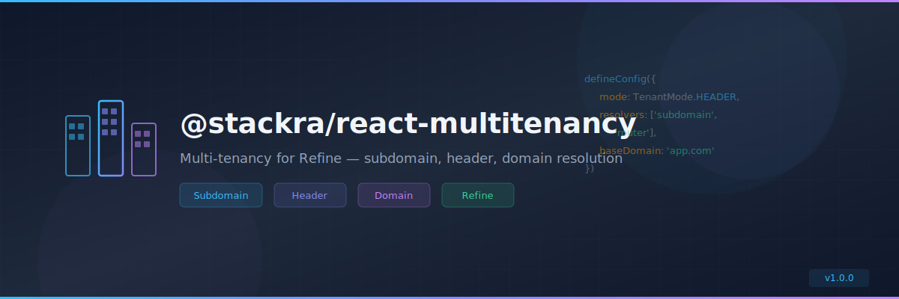

<p align="center">
  
</p>

<p align="center">
  <a href="https://www.npmjs.com/package/@stackra/react-multitenancy">
    
  </a>
  <a href="./LICENSE">
    
  </a>
  <a href="https://www.typescriptlang.org/">
    
  </a>
  <a href="https://react.dev/">
    
  </a>
</p>

---

<p align="center">
  
</p>

<p align="center">
  <a href="https://www.npmjs.com/package/@stackra/react-multitenancy">
    
  </a>
  <a href="./LICENSE">
    
  </a>
  <a href="https://www.typescriptlang.org/">
    
  </a>\n  <a href="https://react.dev/">\n    \n  </a>
</p>

---

<p align="center">
  
</p>

<p align="center">
  <a href="https://www.npmjs.com/package/@stackra/react-multitenancy">
    
  </a>
  <a href="./LICENSE">
    
  </a>
  <a href="https://www.typescriptlang.org/">
    
  </a>
  <a href="https://react.dev/">
    
  </a>
</p>

---

# Multi-Tenancy Configuration

Configuration utilities and presets for `@stackra/multitenancy` package.

## Structure

```
config/
├── index.ts              # Main exports
├── utils.ts              # defineConfig helper
├── presets/
│   ├── default.preset.ts # Default configuration
│   ├── header.preset.ts  # Header-based configuration
│   ├── subdomain.preset.ts # Subdomain-based configuration
│   └── domain.preset.ts  # Domain-based configuration
└── README.md
```

## Usage

### Basic Usage

```typescript
import { defineConfig, subdomainPreset } from '@stackra/multitenancy/config';

const config = defineConfig({
  ...subdomainPreset,
  baseDomain: 'myapp.com',
  fetchTenants: async () => {
    const response = await fetch('/api/tenants');
    return await response.json();
  },
});
```

### Without Preset

```typescript
import { defineConfig, TenantMode } from '@stackra/multitenancy/config';

const config = defineConfig({
  mode: TenantMode.HEADER,
  resolvers: ['subdomain', 'router'],
  baseDomain: 'myapp.com',
  headerName: 'X-Tenant-ID',
  fetchTenants: async () => {
    const response = await fetch('/api/tenants');
    return await response.json();
  },
});
```

## Available Presets

### defaultPreset

Simple filter-based with router resolver:

```typescript
{
  mode: TenantMode.FILTER,
  tenantField: "tenant_id",
  headerName: "X-Tenant-ID",
  queryParam: "tenant_id",
  resolvers: ["router"]
}
```

### headerPreset

Header-based tenant identification:

```typescript
{
  mode: TenantMode.HEADER,
  tenantField: "tenant_id",
  headerName: "X-Tenant-ID",
  queryParam: "tenant_id",
  resolvers: ["header", "router"]
}
```

### subdomainPreset

Subdomain-based SaaS:

```typescript
{
  mode: TenantMode.HEADER,
  headerName: "X-Tenant-ID",
  resolvers: ["subdomain", "router"],
  baseDomain: "example.com"
}
```

### domainPreset

Custom domains with dynamic resolution:

```typescript
{
  mode: TenantMode.HEADER,
  headerName: "X-Tenant-ID",
  resolvers: ["dynamic-domain", "subdomain", "router"],
  baseDomain: "example.com",
  dynamicDomainApiUrl: "/api/tenants/resolve"
}
```

## Configuration Options

### Core Options

- `mode`: How to pass tenant ID to backend (FILTER, HEADER, URL, QUERY)
- `resolvers`: Array of resolver names in priority order
- `fetchTenants`: Function to fetch tenants from your API (required)

### Resolver Configuration

- `baseDomain`: Base domain for subdomain matching
- `pathBasedTenants`: Enable path-based tenant resolution
- `dynamicDomainApiUrl`: API endpoint for dynamic domain resolution
- `dynamicDomainCacheTTL`: Cache TTL for dynamic domain resolver (ms)

### Defaults

- `fallback`: Fallback tenant ID
- `tenantField`: Field name for tenant in filters (default: "tenant_id")
- `headerName`: Header name for HEADER mode (default: "X-Tenant-ID")
- `queryParam`: Query parameter name for QUERY mode (default: "tenant_id")
- `defaultTenant`: Default tenant object

### Feature Flags

- `logging`: Enable debug logging
- `throwOnMissingTenant`: Throw error when tenant resolution fails
- `disableAutoInjection`: Disable automatic tenant context injection

## Dynamic Tenant Resolution

All tenant data comes from your API dynamically. There are no static mappings.

### Fetching Tenants

```typescript
fetchTenants: async () => {
  const response = await fetch('/api/tenants');
  return await response.json();
};
```

### Dynamic Domain Resolution

```typescript
{
  resolvers: ["dynamic-domain"],
  dynamicDomainApiUrl: "/api/tenants/resolve",
  dynamicDomainCacheTTL: 600000 // 10 minutes
}
```

## TypeScript Support

Full TypeScript support with comprehensive type definitions:

```typescript
import type { MultiTenancyOptions } from '@stackra/multitenancy/config';

const config: Partial<MultiTenancyOptions> = {
  mode: TenantMode.HEADER,
  resolvers: ['subdomain', 'router'],
  baseDomain: 'myapp.com',
  fetchTenants: async () => {
    const response = await fetch('/api/tenants');
    return await response.json();
  },
};
```
