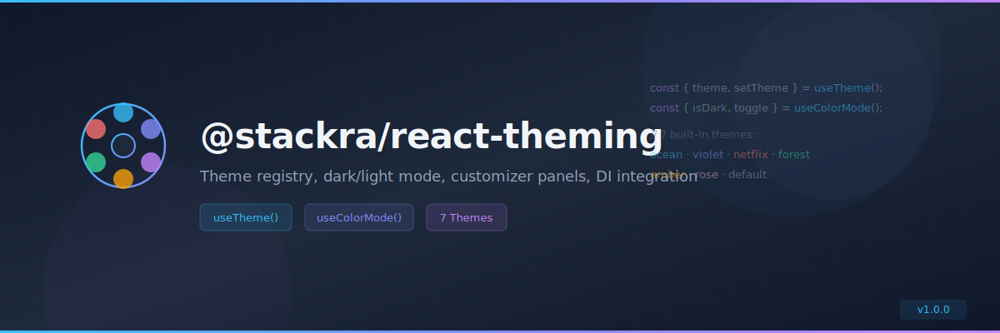

<p align="center">
  
</p>

<p align="center">
  <a href="https://www.npmjs.com/package/@stackra/react-theming">
    
  </a>
  <a href="./LICENSE">
    
  </a>
  <a href="https://www.typescriptlang.org/">
    
  </a>\n  <a href="https://react.dev/">\n    \n  </a>
</p>

---

# @stackra/react-theming

Theme management with registry pattern, dark/light mode, customizer panels, and
DI integration.

## Installation

```bash
pnpm add @stackra/react-theming
```

## Features

- 🏗️ `ThemeModule.forRoot()` / `forFeature()` with DI integration
- 🗂️ `ThemeRegistry` — @Injectable registry for named themes
- 🎨 `CustomizerRegistry` — @Injectable registry for customizer panels
- 🌈 7 built-in themes: Default, Netflix, Ocean, Rose, Forest, Amber, Violet
- ⚛️ `ThemeProvider` React context provider
- 🔀 `ThemeSwitcher` / `ThemeSelector` components
- 🌗 `ModeSwitcher` / `ModeSelector` for dark/light/system mode
- 🎛️ `ThemeCustomizer` panel component
- 🪝 `useTheme()` hook — get/set active theme
- 🌙 `useColorMode()` hook — get/set color mode with `isDark`, `toggle()`
- 🏷️ DI tokens: `THEME_CONFIG`, `THEME_REGISTRY`, `CUSTOMIZER_REGISTRY`

## Usage

### Module Registration

```typescript
/**
 * |-------------------------------------------------------------------
 * | Register ThemeModule in your root AppModule.
 * |-------------------------------------------------------------------
 */
import { Module } from '@stackra/ts-container';
import { ThemeModule } from '@stackra/react-theming';

@Module({
  imports: [
    ThemeModule.forRoot({
      defaultTheme: 'ocean',
      defaultMode: 'dark',
    }),
  ],
})
export class AppModule {}
```

### ThemeProvider

```tsx
/**
 * |-------------------------------------------------------------------
 * | Wrap your app with ThemeProvider for context access.
 * |-------------------------------------------------------------------
 */
import { ThemeProvider } from '@stackra/react-theming';

function Root() {
  return (
    <ThemeProvider>
      <App />
    </ThemeProvider>
  );
}
```

### useTheme Hook

```tsx
/**
 * |-------------------------------------------------------------------
 * | Access and control the active theme.
 * |-------------------------------------------------------------------
 */
import { useTheme } from '@stackra/react-theming';

function ThemePicker() {
  const { theme, setTheme, themes } = useTheme();

  return (
    <div>
      <p>Current: {theme}</p>
      {themes.map((t) => (
        <button key={t.id} onClick={() => setTheme(t.id)}>
          {t.label}
        </button>
      ))}
    </div>
  );
}
```

### useColorMode Hook

```tsx
/**
 * |-------------------------------------------------------------------
 * | Control dark/light/system color mode.
 * |-------------------------------------------------------------------
 */
import { useColorMode } from '@stackra/react-theming';

function ModeToggle() {
  const { isDark, toggle, setMode } = useColorMode();

  return <button onClick={toggle}>{isDark ? '☀️ Light' : '🌙 Dark'}</button>;
}
```

### Feature Module Themes

```typescript
/**
 * |-------------------------------------------------------------------
 * | Register additional themes from feature modules.
 * |-------------------------------------------------------------------
 */
@Module({
  imports: [
    ThemeModule.forFeature([{ id: 'brand', label: 'Brand', color: '#ff6600' }]),
  ],
})
export class BrandModule {}
```

## API Reference

| Export                | Type      | Description                                                                           |
| --------------------- | --------- | ------------------------------------------------------------------------------------- |
| `ThemeModule`         | Module    | DI module with `forRoot()`, `forFeature()`, `registerTheme()`, `registerCustomizer()` |
| `ThemeRegistry`       | Service   | @Injectable registry for named themes                                                 |
| `CustomizerRegistry`  | Service   | @Injectable registry for customizer panels                                            |
| `ThemeProvider`       | Component | React context provider for theme state                                                |
| `ThemeSwitcher`       | Component | Theme selection switcher                                                              |
| `ThemeSelector`       | Component | Theme selection dropdown                                                              |
| `ModeSwitcher`        | Component | Dark/light mode switcher                                                              |
| `ModeSelector`        | Component | Dark/light/system mode selector                                                       |
| `ThemeCustomizer`     | Component | Customizer panel component                                                            |
| `useTheme()`          | Hook      | Returns `{ theme, setTheme, themes }`                                                 |
| `useColorMode()`      | Hook      | Returns `{ mode, setMode, resolvedMode, isDark, isLight, toggle }`                    |
| `THEME_CONFIG`        | Token     | DI token for module configuration                                                     |
| `THEME_REGISTRY`      | Token     | DI token for ThemeRegistry singleton                                                  |
| `CUSTOMIZER_REGISTRY` | Token     | DI token for CustomizerRegistry singleton                                             |
| `BUILT_IN_THEMES`     | Constant  | Array of 7 built-in ThemeConfig objects                                               |

## License

MIT
