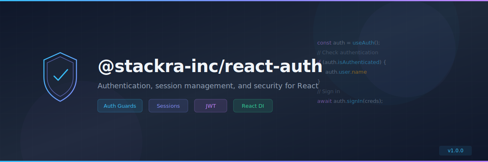

<p align="center">
  
</p>

<p align="center">
  <a href="https://www.npmjs.com/package/@stackra-inc/react-auth">
    
  </a>
  <a href="./LICENSE">
    
  </a>
  <a href="https://www.typescriptlang.org/">
    
  </a>
  <a href="https://react.dev/">
    
  </a>
</p>

---

# @stackra-inc/react-auth

Authentication, session management, and security for React applications. Built
on top of `@stackra-inc/ts-container` for seamless DI integration.

## Installation

```bash
pnpm add @stackra-inc/react-auth
```

## Features

- 🔐 Auth guards and protected routes
- 🎫 JWT token management
- 🔄 Session handling with auto-refresh
- 🪝 `useAuth()` hook for component-level access
- 💉 DI integration via `@stackra-inc/ts-container`
- 🔌 Pluggable auth providers

## Quick Start

```typescript
import { Module } from '@stackra-inc/ts-container';
import { AuthModule } from '@stackra-inc/react-auth';

@Module({
  imports: [
    AuthModule.forRoot({
      provider: 'jwt',
      tokenKey: 'auth_token',
    }),
  ],
})
export class AppModule {}
```

```tsx
import { useAuth } from '@stackra-inc/react-auth';

function Profile() {
  const { user, isAuthenticated, signIn, signOut } = useAuth();

  if (!isAuthenticated) return <LoginForm onSubmit={signIn} />;
  return <div>Welcome, {user.name}</div>;
}
```

## License

MIT © [Stackra](https://github.com/stackra-inc)
