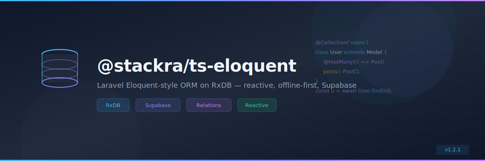

<p align="center">
  
</p>

<p align="center">
  <a href="https://www.npmjs.com/package/@stackra/ts-eloquent">
    
  </a>
  <a href="./LICENSE">
    
  </a>
  <a href="https://www.typescriptlang.org/">
    
  </a>
  <a href="https://react.dev/">
    
  </a>
</p>

---

<p align="center">
  
</p>

<p align="center">
  <a href="https://www.npmjs.com/package/@stackra/ts-eloquent">
    
  </a>
  <a href="./LICENSE">
    
  </a>
  <a href="https://www.typescriptlang.org/">
    
  </a>\n  <a href="https://react.dev/">\n    \n  </a>
</p>

---

<p align="center">
  
</p>

<p align="center">
  <a href="https://www.npmjs.com/package/@stackra/ts-eloquent">
    
  </a>
  <a href="./LICENSE">
    
  </a>
  <a href="https://www.typescriptlang.org/">
    
  </a>
  <a href="https://react.dev/">
    
  </a>
</p>

---

# @stackra/ts-eloquent

Laravel Eloquent-style ORM built on RxDB for client-side TypeScript
applications.

## Installation

```bash
pnpm add @stackra/ts-eloquent
```

## Features

- 🏗️ `EloquentModule.forRoot()` / `forFeature()` with DI integration
- 📦 `Model` base class with Eloquent-style API (`find`, `create`, `update`,
  `delete`)
- 🔍 `QueryBuilder` with `where`, `orderBy`, `limit`, fluent chaining
- 🗂️ Schema layer: `Blueprint`, `SchemaBuilder`, `SchemaResolver`
- 🔗 Relations: `@HasOne`, `@HasMany`, `@BelongsTo`, `@BelongsToMany`
- 🎭 Decorators: `@Collection`, `@Column`, `@PrimaryKey`, `@Fillable`,
  `@Guarded`, `@Hidden`, `@Cast`, `@Index`, `@Timestamps`, `@SoftDeletes`
- 🔄 Lifecycle hooks: `@BeforeCreate`, `@AfterCreate`, `@BeforeUpdate`,
  `@AfterUpdate`, `@BeforeDelete`, `@AfterDelete`
- 👁️ `Observer` pattern with `@ObservedBy` decorator
- 🌱 `Factory` for test data generation
- 🌾 `Seeder` for database seeding
- 📋 `Repository` and `Service` patterns
- 🔀 `Migration` and `MigrationRunner` with auto-migrate support
- 🔌 `ConnectionManager` for multiple named database connections
- 📡 Supabase replication helpers
- ⚛️ React hook: `useFind(Model, id, { live })` with reactive updates
- 🏷️ DI tokens: `ELOQUENT_CONFIG`, `CONNECTION_MANAGER`, `MODEL_REGISTRY`,
  `SCHEMA_RESOLVER`, `MIGRATION_RUNNER`, `SEEDER_RUNNER`

## Usage

### Module Registration

```typescript
/**
 * |-------------------------------------------------------------------
 * | Register EloquentModule in your root AppModule.
 * |-------------------------------------------------------------------
 */
import { Module } from '@stackra/ts-container';
import { EloquentModule } from '@stackra/ts-eloquent';

@Module({
  imports: [
    EloquentModule.forRoot({
      default: 'local',
      connections: {
        local: { driver: 'memory', name: 'app' },
      },
      autoMigrate: true,
    }),
  ],
})
export class AppModule {}
```

### Feature Module

```typescript
/**
 * |-------------------------------------------------------------------
 * | Register models, migrations, seeders, and observers per feature.
 * |-------------------------------------------------------------------
 */
@Module({
  imports: [
    EloquentModule.forFeature({
      models: [User, Post],
      migrations: [CreateUsersTable],
      seeders: [UserSeeder],
      observers: [{ model: User, observer: UserObserver }],
    }),
  ],
})
export class UserModule {}
```

### Defining a Model

```typescript
/**
 * |-------------------------------------------------------------------
 * | Use decorators to define schema, relations, and behavior.
 * |-------------------------------------------------------------------
 */
import {
  Model,
  Collection,
  Column,
  PrimaryKey,
  Fillable,
  HasMany,
  Timestamps,
} from '@stackra/ts-eloquent';

@Collection('users')
@Timestamps()
export class User extends Model {
  @PrimaryKey()
  @Column({ type: 'string' })
  id!: string;

  @Fillable()
  @Column({ type: 'string' })
  name!: string;

  @HasMany(() => Post, 'userId')
  posts!: Post[];
}
```

### Querying

```typescript
/**
 * |-------------------------------------------------------------------
 * | Eloquent-style query builder with fluent chaining.
 * |-------------------------------------------------------------------
 */
const user = await User.find('123');
const admins = await User.query()
  .where('role', '=', 'admin')
  .orderBy('name')
  .get();
const first = await User.query()
  .where('email', '=', 'john@example.com')
  .first();
```

### React Hook

```tsx
/**
 * |-------------------------------------------------------------------
 * | useFind with live mode subscribes to document changes.
 * |-------------------------------------------------------------------
 */
import { useFind } from '@stackra/ts-eloquent';

function UserProfile({ userId }: { userId: string }) {
  const { data: user, loading, error } = useFind(User, userId, { live: true });

  if (loading) return <p>Loading...</p>;
  if (!user) return <p>Not found</p>;
  return <p>{user.getAttribute('name')}</p>;
}
```

## API Reference

| Export                        | Type     | Description                                   |
| ----------------------------- | -------- | --------------------------------------------- |
| `EloquentModule`              | Module   | DI module with `forRoot()` and `forFeature()` |
| `Model`                       | Class    | Base model with Eloquent-style API            |
| `QueryBuilder`                | Class    | Fluent query builder                          |
| `Blueprint` / `SchemaBuilder` | Class    | Schema definition                             |
| `ConnectionManager`           | Service  | Multi-connection management                   |
| `ModelRegistry`               | Registry | Registered model tracking                     |
| `MigrationRegistry`           | Registry | Migration tracking with auto-migrate          |
| `SeederRegistry`              | Registry | Seeder tracking                               |
| `ObserverRegistry`            | Registry | Observer binding tracking                     |
| `Repository`                  | Class    | Repository pattern base class                 |
| `Service`                     | Class    | Service pattern base class                    |
| `Factory`                     | Class    | Test data factory                             |
| `Migration`                   | Class    | Migration base class                          |
| `Seeder`                      | Class    | Seeder base class                             |
| `Observer`                    | Class    | Model observer base class                     |
| `useFind(model, id, opts?)`   | Hook     | Find model by PK with optional live mode      |

## License

MIT
