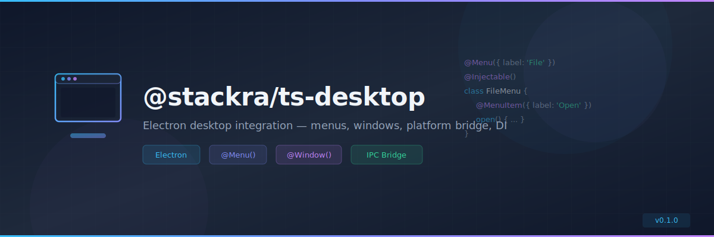

<p align="center">
  
</p>

<p align="center">
  <a href="https://www.npmjs.com/package/@stackra/ts-desktop">
    
  </a>
  <a href="./LICENSE">
    
  </a>
  <a href="https://www.typescriptlang.org/">
    
  </a>
  <a href="https://www.electronjs.org/">
    
  </a>
</p>

---

# @stackra/ts-desktop

Electron desktop integration — menu decorators, window management, platform
bridge, and DI module. Brings NestJS-style DI to Electron main process code.

## Installation

```bash
pnpm add @stackra/ts-desktop
```

## Features

- 🖥️ `@Menu()` / `@MenuItem()` decorators for declarative menu building
- 🪟 `@Window()` decorator for window management
- 🌉 Platform bridge for renderer ↔ main IPC
- 💉 Full `@stackra/ts-container` DI support
- 🏗️ `DesktopModule.forRoot()` pattern
- 🔔 System tray integration
- ⌨️ Global shortcut registration

## Quick Start

```typescript
import { Module } from '@stackra/ts-container';
import { DesktopModule } from '@stackra/ts-desktop';

@Module({
  imports: [DesktopModule.forRoot()],
  providers: [FileMenu, EditMenu, MainWindow],
})
export class AppModule {}
```

```typescript
import { Menu, MenuItem, Injectable } from '@stackra/ts-desktop';

@Menu({ label: 'File' })
@Injectable()
class FileMenu {
  @MenuItem({ label: 'Open', accelerator: 'CmdOrCtrl+O' })
  open() {
    // handle open
  }

  @MenuItem({ label: 'Save', accelerator: 'CmdOrCtrl+S' })
  save() {
    // handle save
  }
}
```

## License

MIT © [Stackra](https://github.com/stackra-inc)
