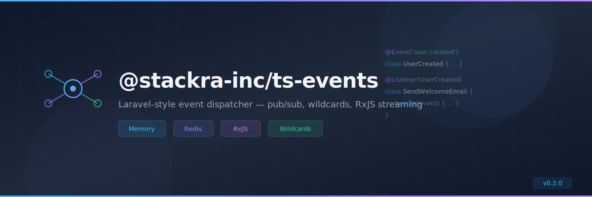

<p align="center">
  
</p>

<p align="center">
  <a href="https://www.npmjs.com/package/@stackra-inc/ts-events">
    
  </a>
  <a href="./LICENSE">
    
  </a>
  <a href="https://www.typescriptlang.org/">
    
  </a>
</p>

---

<p align="center">
  
</p>

<p align="center">
  <a href="https://www.npmjs.com/package/@stackra-inc/ts-events">
    
  </a>
  <a href="./LICENSE">
    
  </a>
  <a href="https://www.typescriptlang.org/">
    
  </a>
</p>

---

<p align="center">
  
</p>

<p align="center">
  <a href="https://www.npmjs.com/package/@stackra-inc/ts-events">
    
  </a>
  <a href="./LICENSE">
    
  </a>
  <a href="https://www.typescriptlang.org/">
    
  </a>
</p>

---

# @stackra-inc/ts-events

Laravel-style event dispatcher for TypeScript with multiple drivers, wildcard
matching, priority listeners, decorators, subscribers, and RxJS streaming.

## Installation

```bash
pnpm add @stackra-inc/ts-events
```

## Features

- 🚀 Multi-driver dispatching: Memory, Redis, Null
- 🎯 Wildcard event matching (`user.*`, `**`)
- ⚡ Priority-based listener execution
- 🔁 One-time listeners via `once()`
- 🎭 `@OnEvent` and `@Subscriber` decorators
- 📡 RxJS observable streaming via `asObservable()`
- 🛑 Halt-on-first-response with `until()`
- 🏗️ `EventsModule.forRoot()` with DI integration
- ⚛️ React hooks: `useEvents()`, `useEvent()`
- 🏷️ DI tokens: `EVENT_CONFIG`, `EVENT_MANAGER`
- 📦 `EventManager` extends `MultipleInstanceManager` pattern
- 🔇 `NullDispatcher` for testing

## Usage

### Module Registration

```typescript
/**
 * |-------------------------------------------------------------------
 * | Register EventsModule in your root AppModule.
 * |-------------------------------------------------------------------
 */
import { Module } from '@stackra-inc/ts-container';
import { EventsModule } from '@stackra-inc/ts-events';

@Module({
  imports: [
    EventsModule.forRoot({
      default: 'memory',
      dispatchers: {
        memory: { driver: 'memory', wildcards: true },
        redis: { driver: 'redis', connection: 'events' },
        test: { driver: 'null' },
      },
    }),
  ],
})
export class AppModule {}
```

### Dispatching Events

```typescript
/**
 * |-------------------------------------------------------------------
 * | Inject EventManager and dispatch events from services.
 * |-------------------------------------------------------------------
 */
import { Injectable, Inject } from '@stackra-inc/ts-container';
import { EventManager, EVENT_MANAGER } from '@stackra-inc/ts-events';

@Injectable()
export class UserService {
  constructor(@Inject(EVENT_MANAGER) private events: EventManager) {}

  async createUser(name: string) {
    const user = { id: '1', name };
    this.events.dispatcher().dispatch('user.created', user);
    return user;
  }
}
```

### Decorators

```typescript
/**
 * |-------------------------------------------------------------------
 * | Use @OnEvent on subscriber methods for declarative listening.
 * |-------------------------------------------------------------------
 */
import { Subscriber, OnEvent } from '@stackra-inc/ts-events';

@Subscriber()
class UserSubscriber {
  subscribe() {}

  @OnEvent('user.created', { priority: 10 })
  onUserCreated(payload: any) {
    console.log('User created:', payload);
  }

  @OnEvent('user.*', { once: true })
  onAnyUserEvent(event: string, payload: any) {
    console.log(`[${event}]`, payload);
  }
}
```

### React Hooks

```tsx
/**
 * |-------------------------------------------------------------------
 * | useEvents() returns the EventManager from DI context.
 * |-------------------------------------------------------------------
 */
import { useEvents, useEvent } from '@stackra-inc/ts-events';

function Notifications() {
  const events = useEvents();

  useEvent('notification.received', (payload) => {
    console.log('New notification:', payload);
  });

  return <div>Listening for notifications...</div>;
}
```

## API Reference

| Export                     | Type       | Description                                            |
| -------------------------- | ---------- | ------------------------------------------------------ |
| `EventsModule`             | Module     | DI module with `forRoot()` static method               |
| `EventManager`             | Service    | Multi-driver manager (extends MultipleInstanceManager) |
| `EventService`             | Service    | High-level API wrapping a single dispatcher            |
| `MemoryDispatcher`         | Dispatcher | In-memory event dispatcher with wildcard support       |
| `RedisDispatcher`          | Dispatcher | Redis-backed cross-process dispatcher                  |
| `NullDispatcher`           | Dispatcher | No-op dispatcher for testing                           |
| `@OnEvent(event, opts?)`   | Decorator  | Mark a method as an event listener                     |
| `@Subscriber()`            | Decorator  | Mark a class as an event subscriber                    |
| `@Channel(name)`           | Decorator  | Bind a subscriber to a specific dispatcher channel     |
| `useEvents()`              | Hook       | Access EventManager from React context                 |
| `useEvent(event, handler)` | Hook       | Subscribe to an event in a component                   |
| `EVENT_CONFIG`             | Token      | DI token for raw config object                         |
| `EVENT_MANAGER`            | Token      | DI token (useExisting alias to EventManager)           |
| `EventPriority`            | Enum       | Priority levels: LOW, NORMAL, HIGH, CRITICAL           |
| `defineConfig()`           | Utility    | Type-safe config helper                                |

## License

MIT
