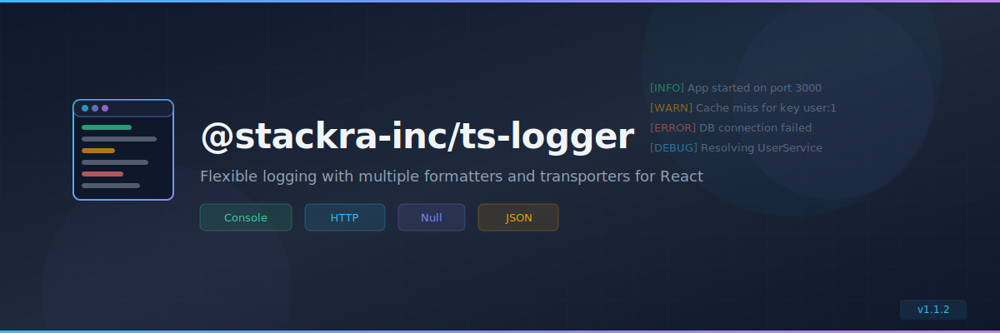

<p align="center">
  
</p>

<p align="center">
  <a href="https://www.npmjs.com/package/@stackra-inc/ts-logger">
    
  </a>
  <a href="./LICENSE">
    
  </a>
  <a href="https://www.typescriptlang.org/">
    
  </a>
</p>

---

<p align="center">
  
</p>

<p align="center">
  <a href="https://www.npmjs.com/package/@stackra-inc/ts-logger">
    
  </a>
  <a href="./LICENSE">
    
  </a>
  <a href="https://www.typescriptlang.org/">
    
  </a>
</p>

---

<p align="center">
  
</p>

<p align="center">
  <a href="https://www.npmjs.com/package/@stackra-inc/ts-logger">
    
  </a>
  <a href="./LICENSE">
    
  </a>
  <a href="https://www.typescriptlang.org/">
    
  </a>
</p>

---

# @stackra-inc/ts-logger

Multi-channel logging system for React with DI integration. Built on
`MultipleInstanceManager` from `@stackra-inc/ts-support`.

## Install

```bash
pnpm add @stackra-inc/ts-logger @stackra-inc/ts-support @stackra-inc/ts-container
```

## Quick Start

```typescript
// 1. Configure
import { defineConfig, LogLevel, ConsoleTransporter, StorageTransporter, SilentTransporter } from '@stackra-inc/ts-logger';

export default defineConfig({
  default: 'console',
  channels: {
    console: {
      transporters: [new ConsoleTransporter({ level: LogLevel.Debug })],
      context: { app: 'my-app' },
    },
    storage: {
      transporters: [new StorageTransporter({ key: 'app-logs', maxEntries: 500 })],
    },
    silent: {
      transporters: [new SilentTransporter()],
    },
  },
});

// 2. Register module
import { Module } from '@stackra-inc/ts-container';
import { LoggerModule } from '@stackra-inc/ts-logger';
import loggerConfig from './config/logger.config';

@Module({
  imports: [LoggerModule.forRoot(loggerConfig)],
})
export class AppModule {}

// 3. Use in services
import { Injectable, Inject } from '@stackra-inc/ts-container';
import { LoggerManager, LOGGER_MANAGER } from '@stackra-inc/ts-logger';

@Injectable()
export class UserService {
  constructor(@Inject(LOGGER_MANAGER) private logger: LoggerManager) {}

  createUser(name: string) {
    this.logger.channel().info('Creating user', { name });
  }
}

// 4. Use in React
import { useLogger } from '@stackra-inc/ts-logger';

function MyComponent() {
  const logger = useLogger();
  logger.info('Component rendered');
  return <div>Hello</div>;
}
```

## Architecture

```
LoggerManager extends MultipleInstanceManager<LoggerConfig>
├── channel(name?) → LoggerService
├── onModuleInit() → warm default
└── onModuleDestroy() → cleanup

LoggerService wraps channel transporters
├── debug / info / warn / error / fatal
├── withContext() / withoutContext()
└── getTransporters()
```

## Transporters

- `ConsoleTransporter` — browser console with colors, emoji, expandable context
  objects
- `StorageTransporter` — localStorage with max entry limit
- `SilentTransporter` — no-op for testing

## Formatters

- `PrettyFormatter` — colors + emoji (console default)
- `JsonFormatter` — JSON (storage default)
- `SimpleFormatter` — plain text

## React Hooks

- `useLogger(channelName?)` — get a LoggerService
- `useLoggerContext(context, channelName?)` — auto-attach context on
  mount/unmount

## DI Tokens

- `LOGGER_CONFIG` — config object
- `LOGGER_MANAGER` — useExisting alias to LoggerManager

## License

MIT
