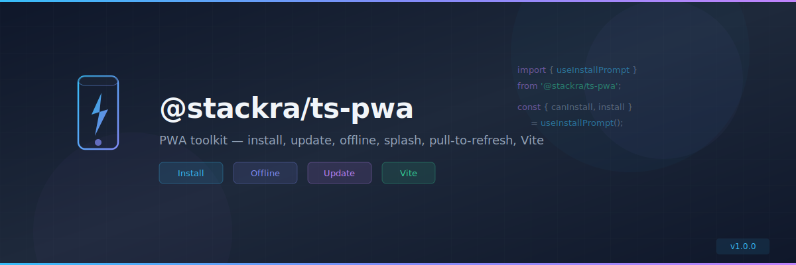

<p align="center">
  
</p>

<p align="center">
  <a href="https://www.npmjs.com/package/@stackra-inc/ts-pwa">
    
  </a>
  <a href="./LICENSE">
    
  </a>
  <a href="https://www.typescriptlang.org/">
    
  </a>
</p>

---

<p align="center">
  
</p>

<p align="center">
  <a href="https://www.npmjs.com/package/@stackra-inc/ts-pwa">
    
  </a>
  <a href="./LICENSE">
    
  </a>
  <a href="https://www.typescriptlang.org/">
    
  </a>
</p>

---

<p align="center">
  
</p>

<p align="center">
  <a href="https://www.npmjs.com/package/@stackra-inc/ts-pwa">
    
  </a>
  <a href="./LICENSE">
    
  </a>
  <a href="https://www.typescriptlang.org/">
    
  </a>
</p>

---

# @stackra-inc/ts-ui

Shared UI primitives — slot system, layout components, and composable patterns.

## Installation

```bash
pnpm add @stackra-inc/ts-ui
```

## Slot System

The slot system enables content injection across component boundaries.
Components define named slot positions with `<Slot>`, and other modules fill
them with `<SlotFill>`.

### Setup

```tsx
import { SlotProvider } from '@stackra-inc/ts-ui';

function App() {
  return (
    <SlotProvider>
      <MyApp />
    </SlotProvider>
  );
}
```

### Define a slot

```tsx
import { Slot } from '@stackra-inc/ts-ui';

function ThemeCustomizer() {
  return (
    <div>
      <Slot name="theme-customizer.before-header" />
      <h2>Theme Customizer</h2>
      <Slot name="theme-customizer.after-header" />
      <div>{/* content */}</div>
      <Slot name="theme-customizer.footer" fallback={<DefaultFooter />} />
    </div>
  );
}
```

### Fill a slot

```tsx
import { SlotFill } from '@stackra-inc/ts-ui';

function BrandingModule() {
  return (
    <SlotFill
      name="theme-customizer.before-header"
      slotKey="branding"
      order={0}
    >
      <BrandingBanner />
    </SlotFill>
  );
}
```

### Hooks

```tsx
import { useSlot, useHasSlot } from '@stackra-inc/ts-ui';

function MyComponent() {
  const hasFooter = useHasSlot('my-component.footer');
  const footerEntries = useSlot('my-component.footer');
}
```

## License

MIT
