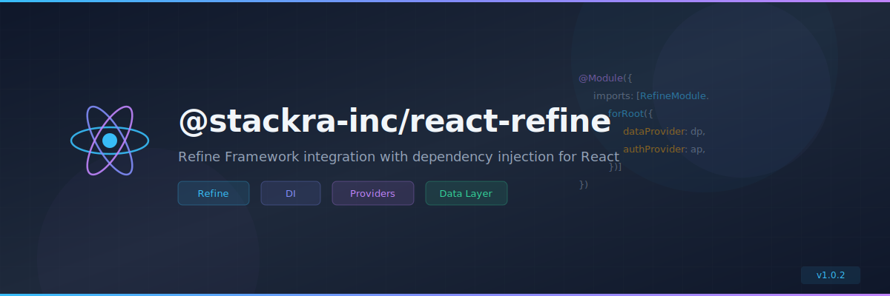

<p align="center">
  
</p>

<p align="center">
  <a href="https://www.npmjs.com/package/@stackra-inc/react-refine">
    
  </a>
  <a href="./LICENSE">
    
  </a>
  <a href="https://www.typescriptlang.org/">
    
  </a>
  <a href="https://react.dev/">
    
  </a>
</p>

---

# @stackra-inc/react-refine

[Refine](https://refine.dev) Framework integration with dependency injection for
React applications. Bridges the `@stackra-inc/ts-container` DI system with
Refine's data, auth, and routing providers.

## Installation

```bash
pnpm add @stackra-inc/react-refine
```

## Features

- 🔌 Refine data provider via DI
- 🔐 Auth provider via DI
- 🗺️ Router integration
- 💉 Full `@stackra-inc/ts-container` DI support
- 🏗️ `RefineModule.forRoot()` pattern
- ⚛️ React hooks for Refine context

## Quick Start

```typescript
import { Module } from '@stackra-inc/ts-container';
import { RefineModule } from '@stackra-inc/react-refine';

@Module({
  imports: [
    RefineModule.forRoot({
      dataProvider: myDataProvider,
      authProvider: myAuthProvider,
    }),
  ],
})
export class AppModule {}
```

## License

MIT © [Stackra](https://github.com/stackra-inc)
