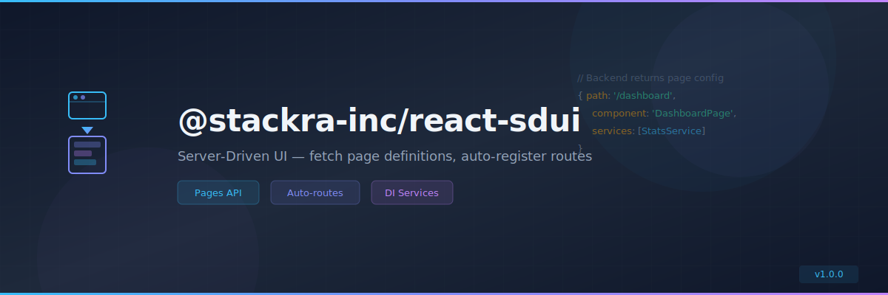

<p align="center">
  
</p>

<p align="center">
  <a href="https://www.npmjs.com/package/@stackra-inc/react-sdui">
    
  </a>
  <a href="./LICENSE">
    
  </a>
  <a href="https://www.typescriptlang.org/">
    
  </a>
</p>

---

# @stackra-inc/react-sdui

Server-Driven UI package for `@stackra-inc/react-refine` — fetches page
definitions from a backend Pages API and auto-registers routes and services.

## Installation

```bash
pnpm add @stackra-inc/react-sdui
```

## Features

- 🌐 Fetch page definitions from a backend Pages API
- 🗺️ Auto-register routes from server config
- 💉 Auto-register DI services per page
- 🔄 Dynamic component resolution
- 🏗️ `SduiModule.forRoot()` pattern
- ⚡ Works with `@stackra-inc/react-refine` and `@stackra-inc/react-router`

## Quick Start

```typescript
import { Module } from '@stackra-inc/ts-container';
import { SduiModule } from '@stackra-inc/react-sdui';

@Module({
  imports: [
    SduiModule.forRoot({
      pagesApiUrl: '/api/pages',
      componentRegistry: {
        DashboardPage: () => import('./pages/Dashboard'),
        UsersPage: () => import('./pages/Users'),
      },
    }),
  ],
})
export class AppModule {}
```

The backend returns page definitions:

```json
[
  {
    "path": "/dashboard",
    "component": "DashboardPage",
    "services": ["StatsService", "ChartService"],
    "meta": { "title": "Dashboard" }
  }
]
```

## License

MIT © [Stackra](https://github.com/stackra-inc)
